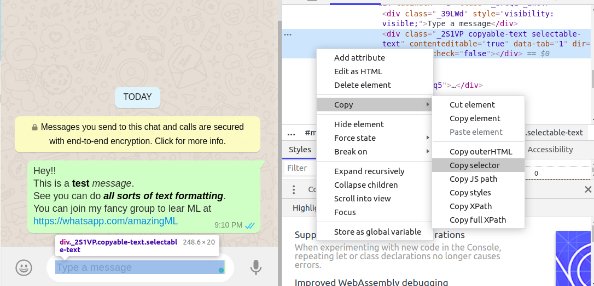

# WhatsApp Bulk Messenger :loudspeaker:

## :dart: What it does 
This tool makes adding multiple people to a WhatsApp group much easier. 

To prevent spam, WhatsApp doesn’t allow users to add anyone who is not there in their contact list to a group. So one has to either send them the group link over email etc., which might not respond to immediately. 

This tool allows you to directly send the link to a list of people, on WhatsApp itself, who can instantly join your group. :tada:

## :rocket: Getting Started 

### :link: Dependencies

1. **Google Chrome** : I expect you've it already installed.
2. **Chromedriver** : Please follow the commands to download Chromedriver or from the [official download page](https://sites.google.com/a/chromium.org/chromedriver/downloads).

    `wget https://chromedriver.storage.googleapis.com/2.41/chromedriver_linux64.zip`
	
	`unzip chromedriver_linux64.zip`
	
	Once downloaded you can configure it by using:
	
	`sudo mv chromedriver /usr/bin/chromedriver`
	
	`sudo chown root:root /usr/bin/chromedriver`
	
	`sudo chmod +x /usr/bin/chromedriver`
	
	_**Process for installing Chromedriver on Windows is also the same as above.**_
	
### :walking: Basic installation 

You may consider using [virtualenv](http://pypi.python.org/pypi/virtualenv) to create isolated Python environments.

1. `Git clone` this project from your terminal or download the zip from GitHub web.
2. Activate your virtual environment if you made one, using 
  `source <venv dir>/activate`
3. `cd` to the project folder.
4. Install the requirements using `pip install -r requirements.txt`

### :iphone: Adding Phone Numbers

You may use any or all of the following methods to enter the mobile numbers

1. When you execute `python run.py`, you can enter any number of comma separated 10 digit phone numbers at the prompt, at once.
2. Update the variable `phone` with a comma separated list of phone numbers.
3. Make a file called `numbers.txt` which will store all the 10 digit numbers, each on a line. To use this feature, uncomment the three commented lines in `run.py` for input from file.

### :running: Running

1. Open the file `run.py` and update the variable `msg` with the message you want to send to all the numbers.
2. Make sure you've added the numbers properly. Make sure there are no duplicates.
3. When the automated Chrome browser window opens up, be ready to scan the QR code with your phone to sign in to WhatsApp Web, more info on how to do this can be found in the [WhatsApp Web faq](https://faq.whatsapp.com/en/web/28080003/).
4. Go grab a :doughnut:, you've earned it.

## :stars: Advanced Tips and Tricks

1. You can add individual messages for each contact, however that will require elementary knowledge in Python, this could be done using a file for input, and might be included in future releases.
2. For using country codes other than India but only one country, please change it in the `url` string in `run.py`.
3. For multiple countries, please remove the _91_ from `url` string, and prepend each number directly with the country code, without plus symbol, for example 09940694571 for the US.
4. You can use any browser, not just Chrome as long as it has a supporting webdriver and install it manually.

## :jack_o_lantern: Debugging
This program uses a CSS Selector to find out where exactly to write the message, just like a human would. And that keeps changing over time based on how web.whatsapp.com is designed. So all we have to do is update the CSS Selector in the code, by doing the following:

1. Right click on the white space in whatsapp web where you type the message, 
2. Press Inspect element
3. From the inspector in chrome or any browser you're using, copy the CSS selector
4. Update the `css_selector` variable in the code.

{:class="img-responsive" width="50%"}
That's it. :smiley:

## :diamond_shape_with_a_dot_inside: Supporting Python3
Use the `urllib.parse.quote` function instead of the `urllib.quote` as in Py2, and obviously use brackets for print. That's it! 
Update :Now it supports both versions, just uncomment the library you need in imports. Defaults to Py3.

## :performing_arts: Disclaimer

This code is in no way affiliated with, authorized, maintained, sponsored or endorsed by WhatsApp or any of its affiliates or subsidiaries. This is an independent and unofficial software. The developers claim no responsibility and offer no warranty.
